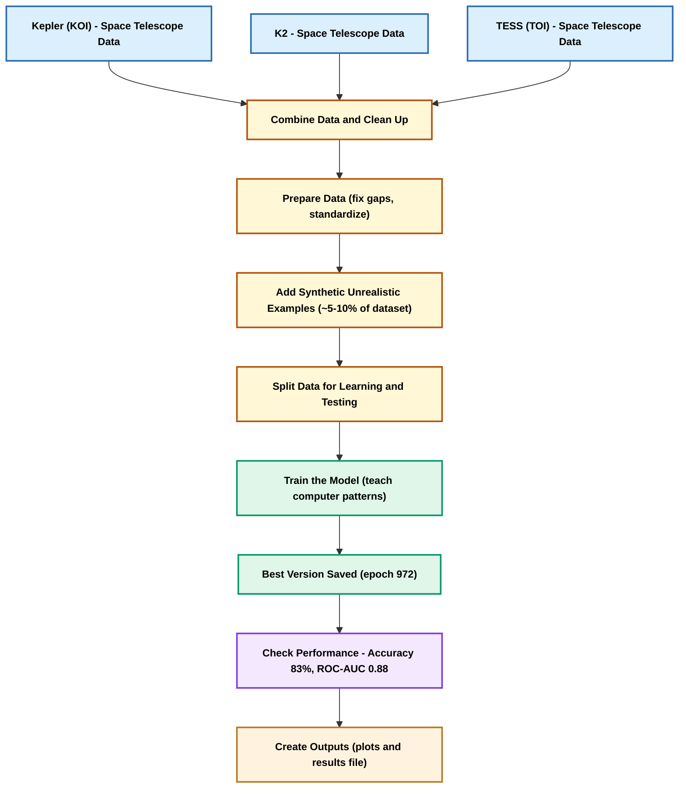
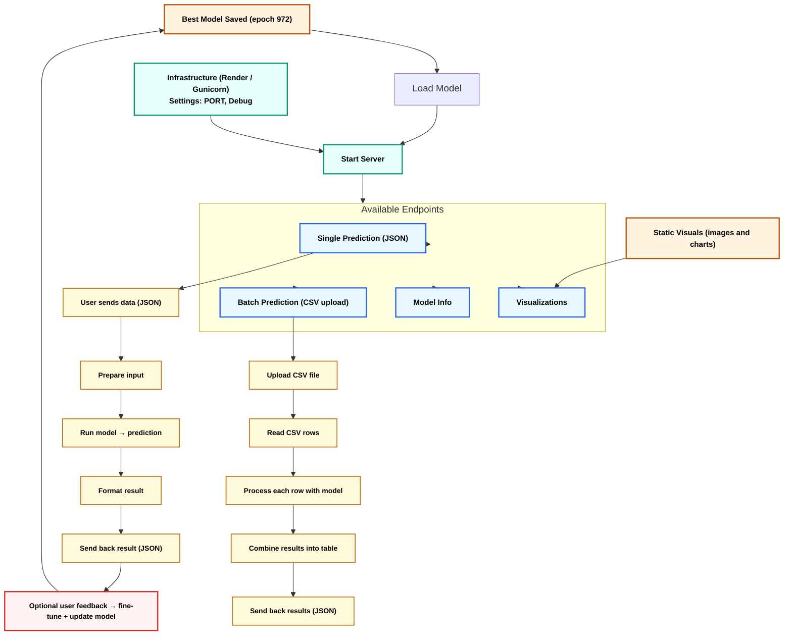

# Space APPS Hackathon - GQ Planets

### ML Model Training Flowchart

```mermaid
flowchart TD
  %% Data
  KEP["Kepler (KOI) - Space Telescope Data"]
  K2["K2 - Space Telescope Data"]
  TESS["TESS (TOI) - Space Telescope Data"]

  MERGE["Combine Data and Clean Up"]
  FE["Prepare Data (fix gaps, standardize)"]
  SYN["Add Synthetic Unrealistic Examples (~5-10% of dataset)"]
  SPLIT["Split Data for Learning and Testing"]

  TRAIN["Train the Model (teach computer patterns)"]
  CKPT["Best Version Saved (epoch 972)"]
  EVAL["Check Performance - Accuracy 83%, ROC-AUC 0.88"]
  ART["Create Outputs (plots and results file)"]

  %% Layout
  KEP --> MERGE
  K2  --> MERGE
  TESS --> MERGE

  MERGE --> FE --> SYN --> SPLIT
  SPLIT --> TRAIN --> CKPT --> EVAL --> ART

  %% Classes
  classDef data fill:#dbeffc,stroke:#2b6cb0,stroke-width:2px,color:#000,font-size:13px,font-weight:600;
  classDef prep fill:#fff7d6,stroke:#b45309,stroke-width:2px,color:#000,font-size:13px,font-weight:600;
  classDef train fill:#dff6e9,stroke:#059669,stroke-width:2px,color:#000,font-size:13px,font-weight:600;
  classDef eval  fill:#f4e8ff,stroke:#7c3aed,stroke-width:2px,color:#000,font-size:13px,font-weight:600;
  classDef art   fill:#fff3e0,stroke:#b7791f,stroke-width:2px,color:#000,font-size:13px,font-weight:600;

  class KEP,K2,TESS data;
  class MERGE,FE,SYN,SPLIT prep;
  class TRAIN,CKPT train;
  class EVAL eval;
  class ART art;
```

### Web

```mermaid
flowchart TD
  CKPT["Best Model Saved (epoch 972)"]
  LOAD["Load Model"]
  STATIC["Static Visuals (images and charts)"]
  START["Start Server"]
  DEPLOY["Infrastructure (Render / Gunicorn)\nSettings: PORT, Debug"]

  subgraph API["Available Endpoints"]
    PRED["Single Prediction (JSON)"]
    BATCH["Batch Prediction (CSV upload)"]
    INFO["Model Info"]
    VIS["Visualizations"]
  end

  %% Single prediction flow (with inline feedback)
  REQ1["User sends data (JSON)"]
  PRE1["Prepare input"]
  MODEL1["Run model → prediction"]
  POST1["Format result"]
  RESP1["Send back result (JSON)"]
  FEEDBACK["Optional user feedback → fine-tune + update model"]

  %% Batch flow
  FILE["Upload CSV file"]
  PARSE["Read CSV rows"]
  LOOP["Process each row with model"]
  AGG["Combine results into table"]
  RESP2["Send back results (JSON)"]

  %% Structure
  CKPT --> LOAD
  LOAD --> START
  START --> API
  STATIC --> VIS
  DEPLOY --> START

  %% Flows
  API --> PRED
  API --> BATCH
  API --> INFO
  API --> VIS

  %% Prediction + inline feedback
  PRED --> REQ1 --> PRE1 --> MODEL1 --> POST1 --> RESP1 --> FEEDBACK --> CKPT

  %% Batch
  BATCH --> FILE --> PARSE --> LOOP --> AGG --> RESP2

  %% Styles for readability
  classDef artifact fill:#fff3e0,stroke:#b45309,stroke-width:2px,color:#000,font-size:13px,font-weight:600;
  classDef server fill:#e6fffb,stroke:#059669,stroke-width:2px,color:#000,font-size:13px,font-weight:600;
  classDef endpoint fill:#e8f6ff,stroke:#2563eb,stroke-width:2px,color:#000,font-size:13px,font-weight:600;
  classDef flow fill:#fff9db,stroke:#b7791f,stroke-width:1.5px,color:#000,font-size:12px,font-weight:600;
  classDef feedback fill:#fef2f2,stroke:#dc2626,stroke-width:2px,color:#000,font-size:12px,font-weight:600;

  class CKPT,STATIC artifact;
  class START,DEPLOY server;
  class PRED,BATCH,INFO,VIS endpoint;
  class REQ1,PRE1,MODEL1,POST1,RESP1,FILE,PARSE,LOOP,AGG,RESP2 flow;
  class FEEDBACK feedback;
```
